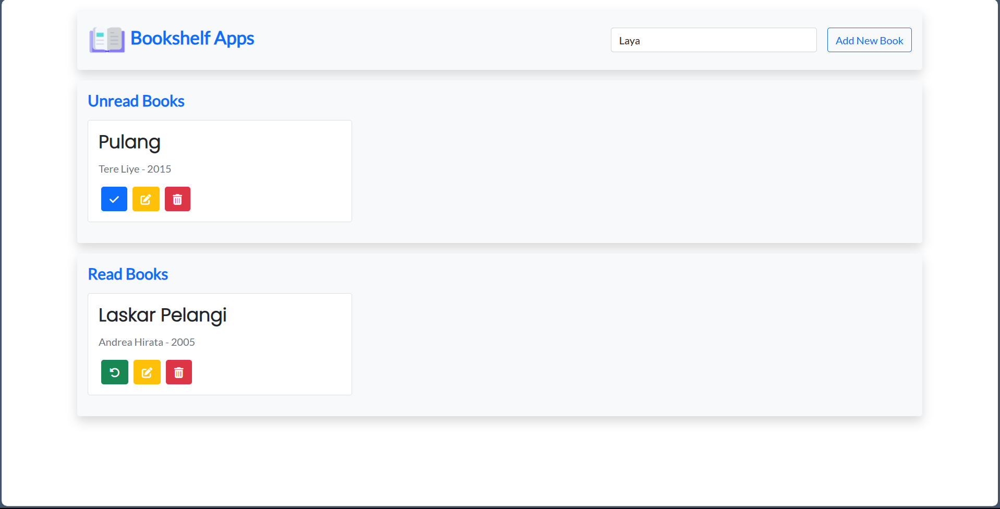

<h1 align="center">Bookshelf Apps</h1>

  <a href="https://royhandf.github.io/bookshelf-apps/" style="text-decoration:none;">Demo Program</a>

## How to Use

- Pertama, Anda harus menambahkan buku Anda
- Kemudian Anda dapat mengatur buku mana yang ingin Anda baca ulang atau selesai baca

Anda dapat menghapus buku Anda jika Anda mau, tetapi jika Anda membutuhkannya lagi, Anda harus menambahkan buku Anda lagi
Anda dapat mencari buku Anda berdasarkan judul.

## Technology Used

- HTML
- CSS
- Javascript

## Author

This website was created by [Royhan Daffa](https://github.com/royhandf)
